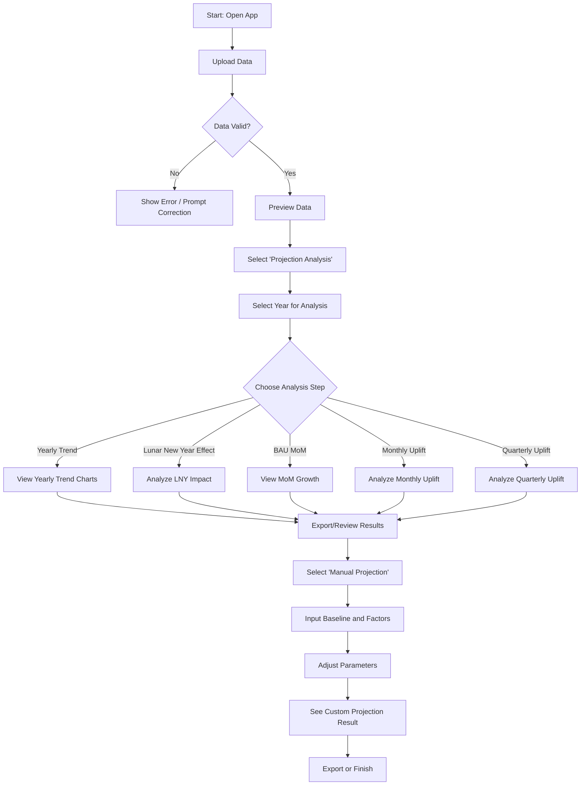

# Projection Automation Tool

A Streamlit application that analyzes business metrics and creates projections based on historical data, allowing for easy visualization of various metrics and their change differences.

## Features

### Navigation Structure
The app is organized into three main sections accessible from the sidebar:

1. **Upload Data**: Upload and preview your business metrics data
2. **Projection Analysis**: Analyze historical data through multiple visualization methods
3. **Manual Projection**: Create custom projections by adjusting various business factors

### Analysis Capabilities
- **Yearly Trend Analysis**: Compare metrics between years with interactive line charts and YoY waterfall plots
- **Lunar New Year Effect**: Analyze the impact of Lunar New Year on business metrics
- **BAU Month-on-Month Growth**: Visualize the month-on-month growth rates for business-as-usual days
- **Special Day Type Analysis**: Visualize monthly and quarterly uplift effects from special day types compared to business-as-usual days
- **Manual Projection Tool**: Create custom projections by adjusting factors like Lunar New Year effect, BAU MoM growth, and special day uplifts

## App Workflow



## Data Format Requirements

Your CSV file should include the following columns:
- `grass_date`: Date in YYYY-MM-DD format
- `date_type`: Different Day Types due to Budget Investment
- `metrics`: Numerical values (fixed column name)

## How to Run

1. Install the requirements:
   ```
   pip install -r requirements.txt
   ```

2. Run the Streamlit app:
   ```
   streamlit run app.py
   ```

3. Open your browser to the URL displayed in the terminal (typically http://localhost:8501)

## Usage Guide

1. **Upload Data Tab**:
   - Upload your CSV file with business metrics data
   - Review the data preview and date range information

2. **Projection Analysis Tab**:
   - Select the year for analysis
   - Navigate through the analysis steps using the horizontal menu (Yearly Trend, Lunar New Year Effect, BAU MoM, Monthly Uplift, Quarterly Uplift)
   - View interactive charts and data tables for each analysis type

3. **Manual Projection Tab**:
   - Enter a baseline value
   - Adjust the effect input (Slider or Direct Input) for each factor: Lunar New Year, BAU MoM, Monthly Uplift, Quarterly Uplift, Additional Factors
   - Instantly see the impact on the projected value and breakdown

## Notes
- The metrics column is fixed as `metrics` (no dynamic column selection).
- All visualizations use Altair and are interactive.
- The app supports data with multiple years and special day types.
- For best results, ensure your data covers at least two consecutive years.
- Error messages and warnings will guide you if required data is missing or incorrectly formatted.
